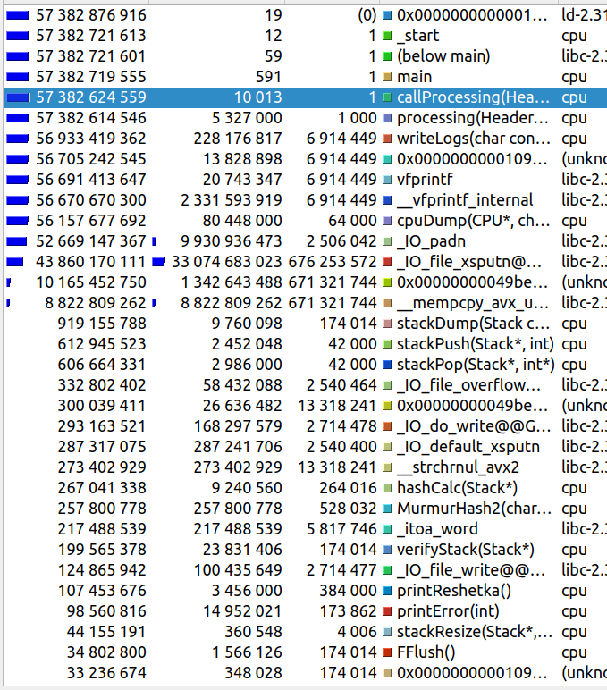
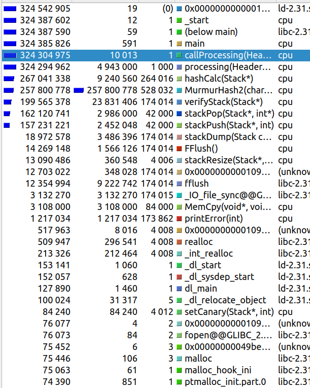
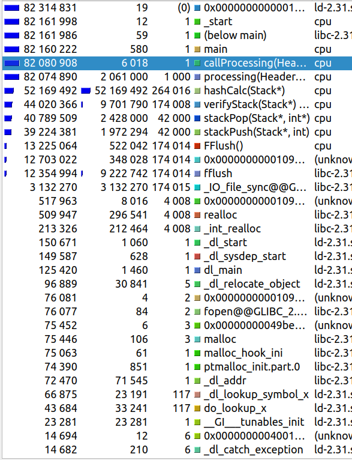
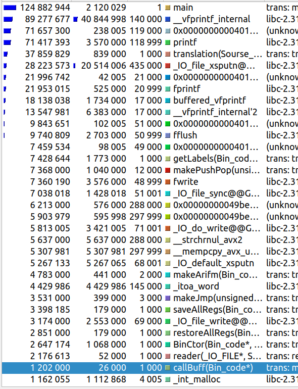
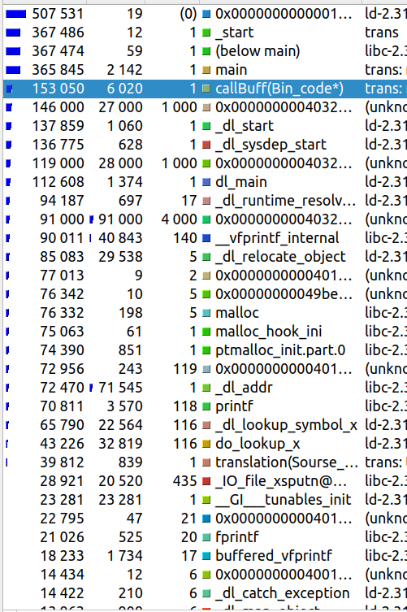

# Binary translator to binary code of x86 architecture
 

-------------------------------------------------
The translation comes from binary code that is created by my own processor, which is located in the "working cpu" repository.

-------------------------------------------------

 

## Basic concept
-------------------------------------------------
By its principle, this is JIT (Just-in-Time), which means that translation and execution occur in almost the same process. How does it work? First, all binary code is translated into a buffer, then this buffer is executed.

 

How certain commands are deployed in x86_64 commands can be viewed in the ASM_LOG file, which is a file in the nasm language, when compiled, a binary code identical to the code generated by the translator will be obtained.

 

## Calling native C functions
-------------------------------------------------
The implementation of the input, output and square root functions are implemented by calling the functions of the C language library. Therefore, when executing already x86_64 binary code, access to C libraries is still required.

 

## Performance comparison
-------------------------------------------------
### Testing methodology and typical mistakes
We will compare directly the execution of the binary code execution on my processor and on the x86_64 architecture processor.  For successful testing and obtaining real results, several actions should be performed:
    
1. Isolate the parts of both programs that are responsible for execution from other parts so that slow functions (for example, printf) do not affect the execution time.
2. When testing any system, errors are possible, so it is necessary to perform more than one execution cycle, in our tests we will execute the code 1000 times.
3. It is necessary to completely disable the logs
4. Choose a program as the code of the tested program so that it uses approximately all the capabilities of processors equally. This will help to avoid distorting the performance of the program due to the specifics of the implementation of a particular process.
5. It is necessary to set the compiler optimization flags to the maximum possible value (-O3 in our case).
6. Exclude keyboard input so that the results do not affect the tester's printing speed.

 

Next, several stages of testing the program of my processor will be shown, which will show how much all these points are needed.

-------------------------------------------------
As a test program, it will use recursive factorial calculation for the number 5. Without reading from the keyboard and without displaying the result on the screen. Thus, we will use arithmetic operations, function calls, and jumps.

-------------------------------------------------
    The performance evaluation will be performed by the kcachegrind program.

 

>### Test run without disabling logs (my cpu)

After any operation, my processor writes a dump to the log file, where it describes in detail the state of my stack, as well as a dump of the binary buffer indicating which instruction it is currently on. All this is done using the fprintf() function in the log file

As you can see, we got very strange results. 99% of the program execution time is spent writing to a log file. Naturally, this cannot even come close to giving an understanding of the true performance of the program.

 

>### Test run with disabled logs (my cpu)

After disabling the logs, we get a performance gain of 177 times. Now we can say that our result reflects the performance of the program quite well.

 

>### Test run without logs with -O3 flag (my cpu)

We got a 4x performance gain just because of the -O3 flag and a 699x increase compared to the version without -O3 with logs.

 

    Only now our program is ready for comparison!

 

-------------------------------------------------
Now, using the example of a binary translator, we will make sure that isolating the part responsible for execution is simply necessary.

-------------------------------------------------

 

>### Test run of the translator without isolation of the execution process from the translation process

The process of execution of the translated code takes 1% of the entire execution time of the program, the situation is similar to the case of logs included. It is impossible to evaluate the performance of such a program

 

>### Test run of the translator with isolation of the execution process

The total execution time of the program was reduced by 246 times compared to the non-isolated version.

 

    Only now our program is ready for comparison!

 

## Final performance comparison

Let's look at all the tests performed and compare the correctly measured data for each of the architectures.

 

### My cpu

|Logs -O0   |no Logs -O0|no Logs -O3|
|:---------:|:---------:|:---------:|
|57382624559|324304975  |82080908   |
|           | 177  |699|

So, counting factorial 5 on an x86_64 architecture processor works 

    536 times 

faster than on my processor. This is not surprising, because one x86_64 command is revealed in a huge number of commands of my processor. Even the -O3 compilation flag is not able to significantly affect this situation.

-------------------------------------------------

## Installation

    git clone https://github.com/jirol9xa/binaryTranslator

making project:

    make

The command line argument must specify the name of the binary code file.
Running:

    ./trans <file_name>